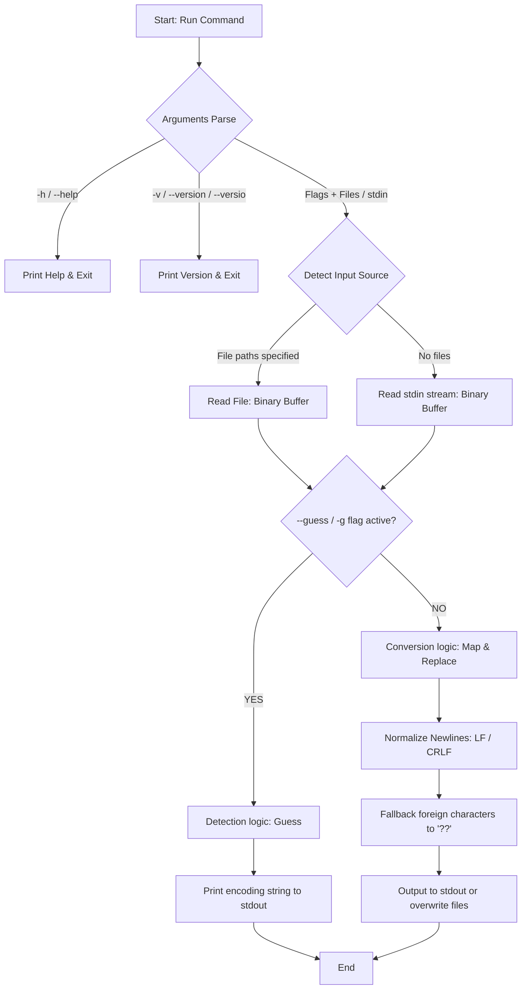
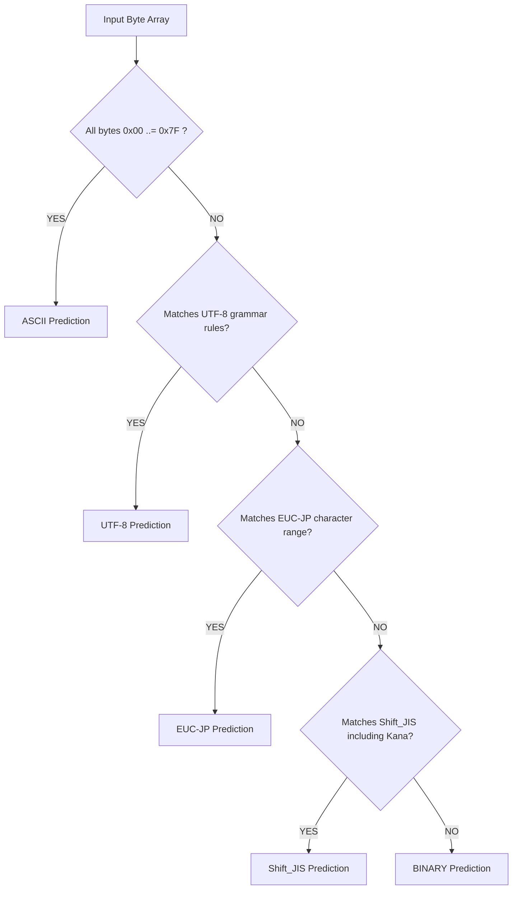

**English** | [日本語版](../ja/DIAGRAM.md)

# System Diagram (DIAGRAM.md)

This document represents the execution flow and data processing structures of `MyNKF` and its Web desktop simulator using Mermaid diagrams.

---

## 1. Overall Data Flow (CLI Utility)

The pipeline showing command execution, arguments parsing, input checks, conversion, and stdout output.



---

## 2. Encoding Auto-Detection Algorithm (Guess Flow)

The heuristic process identifying file encodings by scanning byte structures.



---

## 3. Web Desktop Simulator & Obsidian Integration

The integration setup of the React app and Rust document exporter.

```mermaid
graph TD
    subgraph Browser_Environment [Web Browser (Vite + React)]
        A[App.tsx] --> B[DesktopSimulator.tsx]
        A --> C[ObsidianDocs.tsx]
        
        subgraph Simulator_Components [Simulator Layouts]
            B --> B1[CLI Terminal Simulator]
            B --> B2[File Drag & Drop Area]
            B --> B3[Visual Simulation: Topmost Window / Win11 Frame]
        end
        
        subgraph Export_Engine [Obsidian Integration Exporter]
            C --> C1[1. Export CHANGELOG]
            C --> C2[2. Export SPEC.md Specifications]
            C --> C3[3. Export Rust src/main.rs code]
            C --> C4[4. Export TESTING report]
            C --> C5[5. Export DIAGRAM.md diagrams]
        end
    end

    B2 -->|Dropped Files| B1
    C1 -->|Clipboard Copier / ZIP Download| User[User Obsidian]
    C2 -->|Clipboard Copier / ZIP Download| User
    C3 -->|Clipboard Copier / ZIP Download| User
    C4 -->|Clipboard Copier / ZIP Download| User
    C5 -->|Clipboard Copier / ZIP Download| User
```


